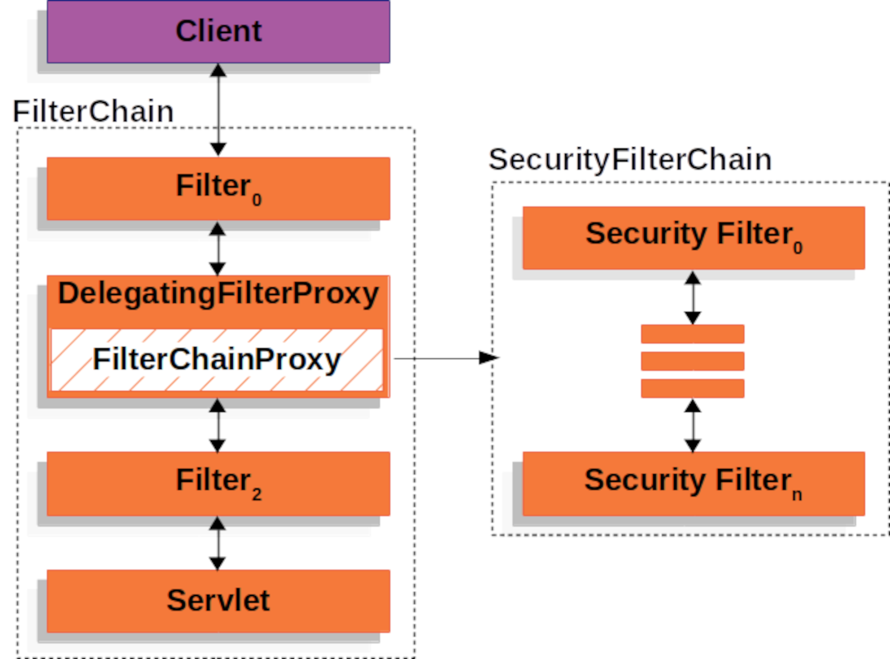
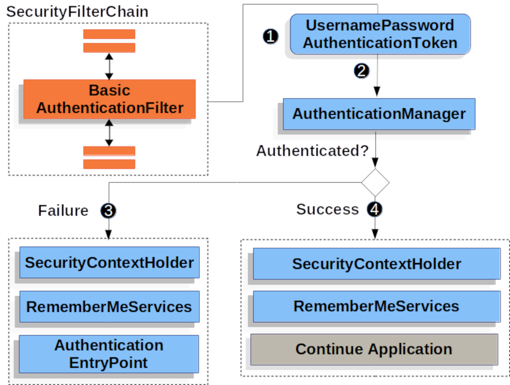
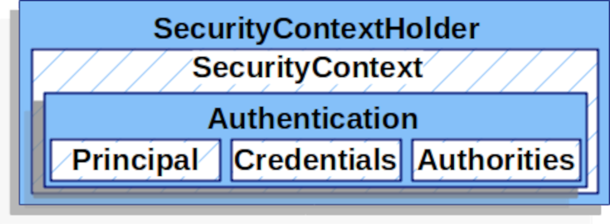

# whoami

Hi, I'm Josh Cummings.

I've worked on Spring Security for about the last 5 years.
I've worked with it for much longer (c. 2008)
And I've worked adjacent to it for even longer (c. 2005)

## Points of Interest

I have seven children and one wife.
I like to juggle.

## Level of Java Fame Continuum

|--Josh Cummings-----------------------Josh Long-------------Josh Bloch--|

## You can find me at

- [Spring Security](https://github.com/spring-projects/spring-security)
- [Terracotta Bank](https://github.com/terracotta-bank/terracotta-bank)
- [Pluralsight](https://pluralsight.com)
- [@jzheaux](https://twitter.com/jzheaux)

---

# What are your goals?

> - Hope over into the Group Chat to share...
> - ... and while you're thinking about that, I'll share mine.

---

# Definitions

Spring Security REST **API**

*API*: The interface by which one program commands another program

---

# Definitions

Spring Security **REST** API

*REST*: A way to model resources over HTTP

> - GET, POST, PUT, DELETE methods
> - 2xx & 4xx responses

---

# Definitions

**Spring Security** REST API

> - *Spring*: An application framework that uses *dependency injection*

> - *Spring Security*: Authn, Authz, and Defense

---

# Plan for today

> * Add BASIC authentication to a REST API
> * Add CORS and CSRF defense
> * Change to Bearer Token authentication
> * Add authorization
> * Prepare the code for 6.0

---

# The Filter Chain

---

# Basic Auth

---

# The Principal

---
